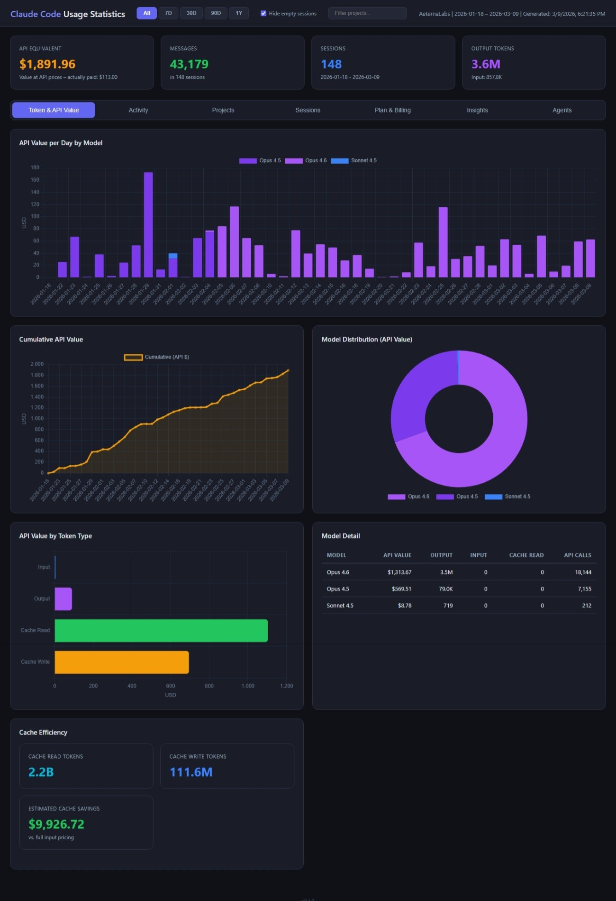
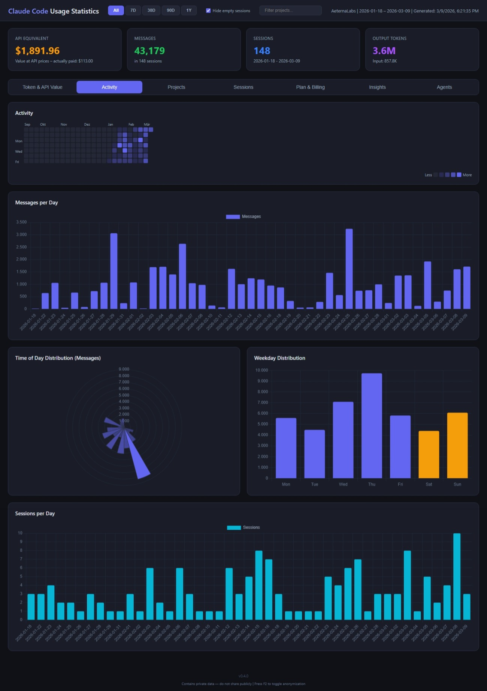
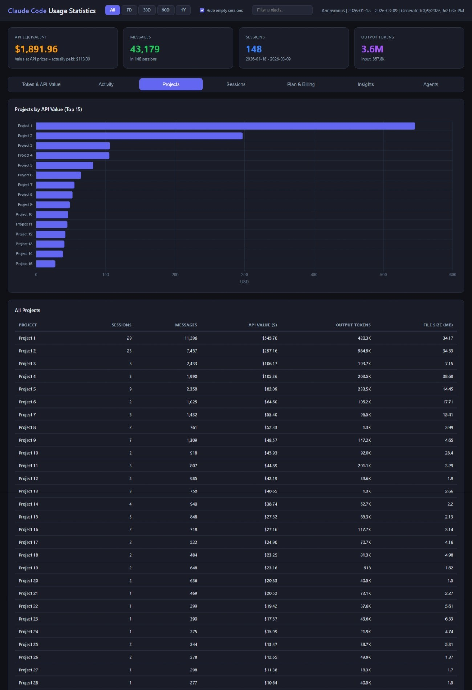
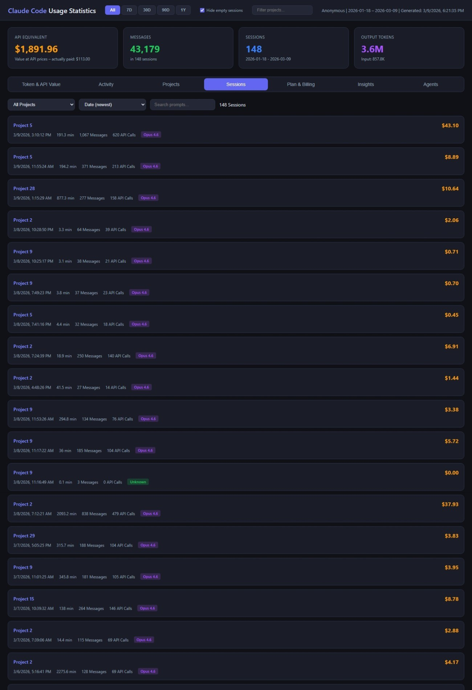
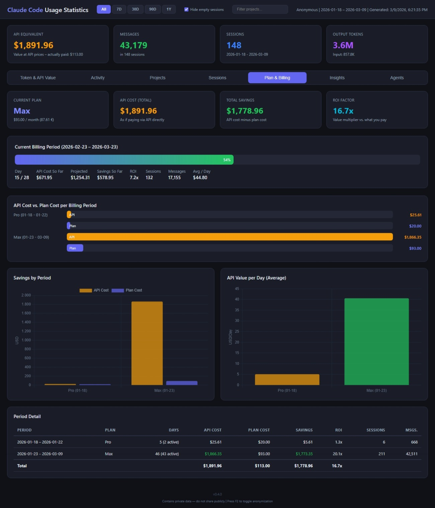
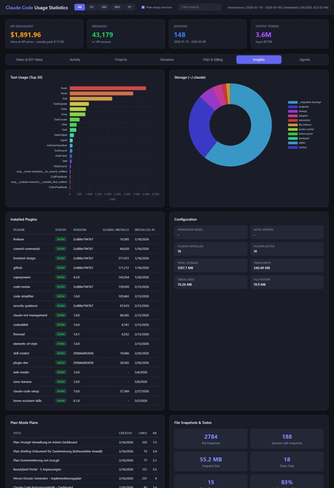
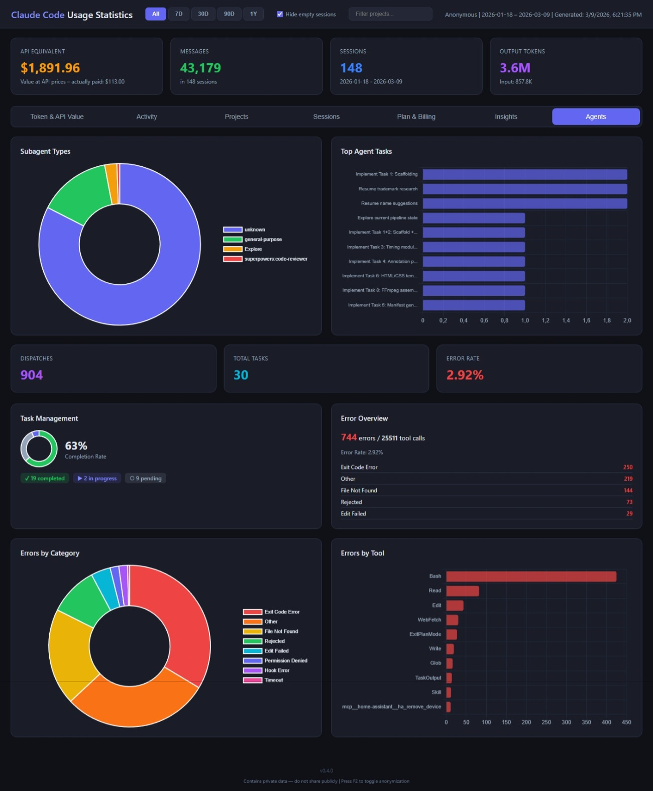

# Claude Code Usage Statistics

A comprehensive analytics dashboard for [Claude Code](https://docs.anthropic.com/en/docs/claude-code) usage data. Parses your local Claude Code session transcripts, calculates hypothetical API costs, and generates an interactive HTML dashboard.

***Disclaimer:*** *This is an unofficial, community-built tool. Not affiliated with or endorsed by Anthropic.*

> [!WARNING]
> This dashboard may contain **sensitive data**: source code snippets, file paths, API keys, project memories, conversation history, and internal notes. **Do NOT publish the generated output to the public internet or any unsecured location.** Use authentication or keep it local. Use `--no-memories` to exclude project memory content. Press `F2` in the dashboard to toggle anonymization mode for screenshots.

## Features

- **Time Range & Project Filter** -- Global pill buttons (All / 7D / 30D / 90D / 1Y) and project search to filter the entire dashboard; plan costs adjust proportionally to the selected range
- **KPI Dashboard** -- Total API-equivalent cost, messages, sessions, token breakdown with hover tooltips explaining each metric
- **Session Flow Visualization** -- Interactive canvas-based session replay with node graph, particle animations, auto-play timeline, and fullscreen mode
- **Token & API Value** -- Daily costs, cumulative costs, model distribution
- **Activity** -- Message patterns, hourly distribution, weekday distribution
- **Agents** -- Subagent type distribution, error breakdown by category and tool, task management
- **Projects** -- Top projects by cost, detailed project pages with memories and workflow timeline
- **Sessions** -- Filterable/searchable session details with chat replay and subagent prompt viewer; export individual chats or the entire filtered set as Markdown (ZIP)
- **Plan & Billing** -- Cost savings analysis vs. your subscription plan, split into monthly billing cycles
- **Insights** -- Tool usage, storage breakdown, git ops, telemetry, performance metrics
- **Privacy** -- F2 anonymization mode, configurable display name, empty session filter
- **Mobile Responsive** -- Dashboard layout adapts to mobile screens

<table>
  <tr>
    <td><a href="assets/claude-code-stats-01.jpeg"></a></td>
    <td><a href="assets/claude-code-stats-02.jpeg"></a></td>
    <td><a href="assets/claude-code-stats-03.jpeg"></a></td>
    <td><a href="assets/claude-code-stats-04.jpeg"></a></td>
  </tr>
  <tr>
    <td><a href="assets/claude-code-stats-05.jpeg"></a></td>
    <td><a href="assets/claude-code-stats-06.jpeg"></a></td>
    <td><a href="assets/claude-code-stats-07.jpeg"></a></td>
    <td></td>
  </tr>
</table>

## Quick Start

1. **Clone the repository**
   ```bash
   git clone https://github.com/AeternaLabsHQ/claude-code-stats.git
   cd claude-code-stats
   ```

2. **Create your configuration**
   ```bash
   cp config.example.json config.json
   ```
   Edit `config.json` to match your subscription plan and preferences.

3. **Run the extractor**
   ```bash
   python3 extract_stats.py
   ```

4. **Open the dashboard**
   ```bash
   open public/index.html      # macOS
   xdg-open public/index.html  # Linux
   start public/index.html     # Windows
   ```

## Configuration

See [`config.example.json`](config.example.json) for all options:

| Key | Type | Default | Description |
|-----|------|---------|-------------|
| `language` | `string` | `"en"` | UI language (`"en"`, `"de"`, or `"fr"`) |
| `plan_history` | `array` | `[]` | Your subscription plan history |
| `rtk.enabled` | `bool` | `true` | Show the RTK savings tab (if RTK is installed) |
| `rtk.db_path` | `string` | `null` | Override path to RTK's `history.db` (auto-detected if null) |
| `rtk.token_price_low_usd_per_mtok` | `number` | `3.00` | Low end of the input-token rate range for estimating cost avoided |
| `rtk.token_price_high_usd_per_mtok` | `number` | `5.00` | High end of the input-token rate range for estimating cost avoided |

### Plan History

Each entry in `plan_history` represents a subscription period:

```json
{
  "plan": "Max",
  "start": "2026-01-23",
  "end": null,
  "cost_eur": 87.61,
  "cost_usd": 93.00,
  "billing_day": 23
}
```

- `end: null` means the plan is currently active
- `billing_day` determines billing cycle boundaries for cost analysis

### RTK Savings (optional)

If you use [RTK (Rust Token Killer)](https://github.com/AeternaLabsHQ/rtk), the dashboard adds an **RTK Savings** tab. It reads RTK's `history.db` (read-only) and shows tokens saved, a per-command breakdown, a daily timeline, and an estimated cost avoided.

The cost figure is an **estimate** shown as a range: saved tokens are priced between a low and high input-token rate (`rtk.token_price_low_usd_per_mtok` / `..._high_...`, defaults `3.00`–`5.00`), not a billed amount. The tab is hidden automatically if RTK is not installed.

## Output

The script generates files in the `public/` directory:

- `index.html` -- Self-contained interactive dashboard (open in any browser)
- `dashboard_data.json` -- Raw aggregated data (for custom analysis)

## Security & Privacy

This tool is designed to run **entirely on your machine**. Nothing is ever sent over the network: `extract_stats.py` only reads local files and writes static HTML/JSON into `public/`. Used locally, it's safe.

What you need to know before you do anything beyond opening the file locally:

- **The generated output embeds your raw conversation history in plaintext.** Every session HTML (`public/sessions/*.html`) contains the full text of your prompts and Claude's responses, plus file paths, internal URLs, git commit messages, command output, and (unless excluded) project memories. Treat the `public/` directory like a copy of your transcripts -- because that's what it is.
- **Never host it on a public or shared URL.** No login wall, no "private" link, no `python -m http.server` exposed to a network. If you must share, copy the static files behind real authentication, on a host you control.
- **Exports carry everything too.** The "export all as Markdown (ZIP)" button bundles full chat content. Don't email or upload those blindly.
- **Scrub before sharing screenshots.** Press `F2` in the dashboard for anonymization mode. Use `--no-memories` to keep project memory content out of the build entirely.
- **The output is unencrypted.** `public/` is gitignored so it won't land in a commit, but it sits in plaintext on disk -- on a shared machine, anyone with read access can read your history.
- **Offline rendering is not fully airtight.** The HTML pulls a few JS libraries (Chart.js, JSZip, highlight.js) from public CDNs, so opening the dashboard contacts those CDNs. Your data still never leaves your browser, but the page isn't usable fully offline and isn't isolated from CDN supply-chain risk.

## Automation

To auto-refresh the dashboard periodically:

```bash
*/10 * * * * cd /path/to/claude-stats && python3 extract_stats.py 2>&1 >> update.log
```

## Important: Prevent Claude Code from Deleting Session Data

Claude Code **automatically deletes session transcript files older than 30 days** on every startup ([docs](https://docs.anthropic.com/en/docs/claude-code/overview#application-data)). Your `history.jsonl` (prompt recall) is kept, but the detailed JSONL transcripts in `~/.claude/projects/` -- which this dashboard depends on for cost calculation, token breakdowns, and session replay -- are permanently removed.

To preserve your data, add `cleanupPeriodDays` to your `~/.claude/settings.json` ([settings reference](https://docs.anthropic.com/en/docs/claude-code/settings#available-settings)):

```json
{
  "cleanupPeriodDays": 99999
}
```

> [!CAUTION]
> Without this setting, you will silently lose historical session data every time Claude Code starts. There is no recovery mechanism -- once the files are deleted, the cost and token data they contained is gone.

> [!NOTE]
> Do not set the value to `0` -- this disables transcript persistence entirely ([#23710](https://github.com/anthropics/claude-code/issues/23710)). The minimum allowed value is `1`.

## Requirements

- Python 3.8+
- No external dependencies (stdlib only)
- Claude Code installed with session data in `~/.claude/`

## Localization

The dashboard supports English and German. Set `"language": "en"` or `"language": "de"` in your `config.json`.

To add a new language, create a file in `locales/` following the structure of [`locales/en.json`](locales/en.json).

## License

MIT
